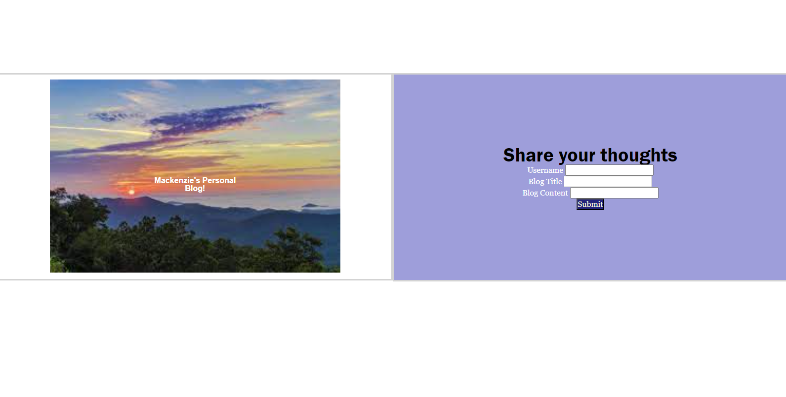
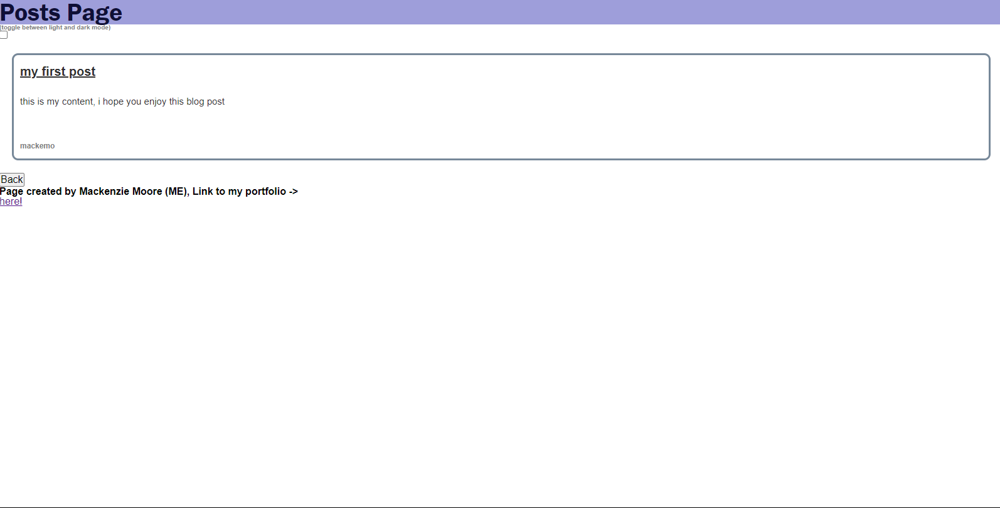

# 4-personal-blog

## Description

The fourth challenge assignment from a bootcamp where the task was to create a two-page website from scratch. The website allows users to input blog content and view blog posts. 

## Process

The process included creating a form for blog title, content and author with a submit button. Once the button is pressed, a new page pops up showing the posts page with all of the blog posts. There is a back button to go back to the main page with the form. The blog posts are pulled from local storage and displayed on teh page. Included in the posts page is a toggle button to swtich from light and dark mode. At the bottom of the page include the link to the developer's portfolio.

## Links

Link to website used for this challenge.
https://mackemo.github.io/4-personal-blog/

Link to public Github repository for this challenge.
https://github.com/mackemo/4-personal-blog

## Installation

N/A

## Usage

This site was a practice assignment for bootcamp students but can be used to see how a simple website can be created by inspecting the webpage.

## Credits

N/A

## License

N/A

## Acknowledgement

Project was done by the knowledge learned from bootcamp instructor John and other online resources, (links are below):

https://www.w3schools.com/howto/howto_css_image_text.asp

https://www.w3schools.com/html/html_forms.asp

https://www.w3schools.com/tags/att_form_method.asp

https://stackoverflow.com/questions/16562577/how-can-i-make-a-button-redirect-my-page-to-another-page
